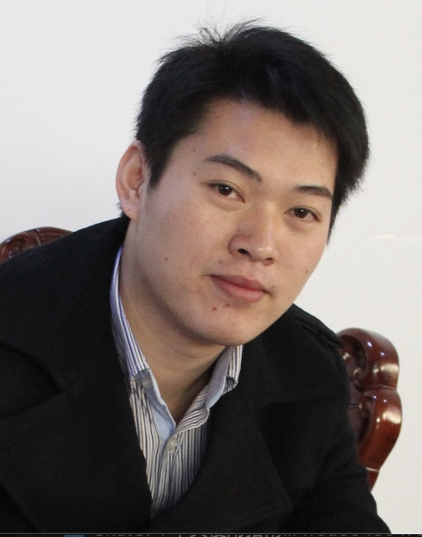

## 个人简介

在IT互联网、人工智能和在线教育行业内，曾任职于多家顶级公司；

拥有13年的人力资源管理经验，曾担任模块专家、HR经理、区域人力负责人和HRBP经理岗位；

2次创业经历，独立建立了整套人力资源制度和体系，有效支撑了千人规模和过亿体量的业务运作；

2次从零开始搭建区域团队，仅用2个月时间搭建100人的产研团队，成功执行公司区域战略，交付过千万级的政府履约项目。

## 任职经历
成都超有爱科技（[百词斩](https://www.baicizhan.com/)）【背单词TOP】

旷视科技（[Face++](https://www.megvii.com)）【AI领域TOP】

成都果小美科技有限公司【无人新零售TOP】

北京今目标科技【国内最早做企业办公IM】

[IObit](https://www.iobit.com) Co, Ltd.【系统安全软件、欧美版的腾讯管家和360安全卫士】

## 一些新鲜事

| 时间          | 进展                                                        | 主要价值    |
| ------------- | ------------------------------------------------------------ | -------- |
| 2023.10    | - 开始研究[AI异议处理对练工具](https://pan.baidu.com/s/1Q6I_CxaOHo1TFg1ykorvhA?pwd=1234) - 上线雅思异议处理对练11月正式 - 所有sku异议处理AI对练工具12月上线 |- 降低了新人培训中模拟练习的成本 - 增加了模拟练习的频次，加强了用户沟通体感 -   覆盖了主要的用户问题    |
| 2023.09     | - 开始研究雅思作业AI批改工具 - 销售团队雅思写作批改工具9月底上线 - 运营团队[雅思小作文批改工具](https://s11.ax1x.com/2024/01/02/piXz9qx.jpg)10月上线 |-  解决了批改正确率低的问题 - 增加了批改效率 - 降低了批改老师的人数节约了人力成本         |
| 2023.08    | - 开始研究GPT在销售团队的提效 - 编程产品的Roleplay工具10月上线 - 6个英语sku销售团队的[Roleplay工具]()11月上线 |- 解决了新人线上销售缺乏全流程体感的问题 - 降低了新人培训中模拟练习的成本 - 增加了模拟练习的频次，加强了用户沟通体感          |
| 2023.06     | - 推动AIGC在公司层面的培训推广 - 6-8月：完成技术专场、教研专场、销售服务专场的系列培训 | - 普及AIGC的基本知识，覆盖了50%以上的员工，达到了启蒙效果          |
| 2023.05     | - 开始配合CEO推动公司层面的AIGC项目可行性研究 - 6月：成功确定3个项目（内容量产、教研分诊、AI助记忆） |- 成功推动了3个重点项目启动          |
| 2023.03     | - 开始研究GPT在人力资源领域的应用 - 第一版[AI模拟面试Demo](https://pan.baidu.com/s/1ZXIjVB8uAmumg8qZjIUI7g?pwd=1234) 4月底上线 |- 为HR团队在AI领域的研究奠定了基础          |

<!--
2023年10月，开始研究AI异议处理对练工具，11月正式上线雅思异议处理对练，12月上线所有sku异议处理AI对练工具；
2023年9月，开始研究雅思作业AI批改工具,9月底上线了销售团队雅思写作批改工具，10月上线了运营团队雅思小作文批改工具；
2023年8月，开始研究GPT在销售团队的提效，10月上线了编程产品的Roleplay工具，11月上线了6个英语sku销售团队的Roleplay工具；
2023年6月，推动AIGC在公司层面的培训推广，6-8月分别完成技术专场、教研专场、销售服务专场的系列培训；
2023年5月，开始配合CEO推动公司层面的AIGC项目可行性研究，6月成功确定3个项目（内容量产、教研分诊、AI助记忆）;
2023年3月，开始研究GPT在人力资源领域的应用，4月底完成第一版AI模拟面试Demo；

1. GPT的研究有了一些落地的AI应用：
    * 社群销售线上沟通Roleplay工具[【项目介绍】]()
    * 雅思作业批改的AI工具[【项目介绍】]()
    * 销售异议Roleplay工具[【项目介绍】]()
2. 借助GPT和claude完成了对青龙面板学习的闭环：
    * 完成了美团发券项目的产品化[【项目介绍】]()

## 共事过的大拿

1. [Philip Zheng](https://www.linkedin.com/in/philip-zheng-7b239813/)
2. [刘帅成](http://www.liushuaicheng.org/)
3. 观音（陈航英）
4. 玄念（郝华明）

## 读书学习

[微信读书书单]()|[人力资源管理100问]()| [知乎]()

-->
